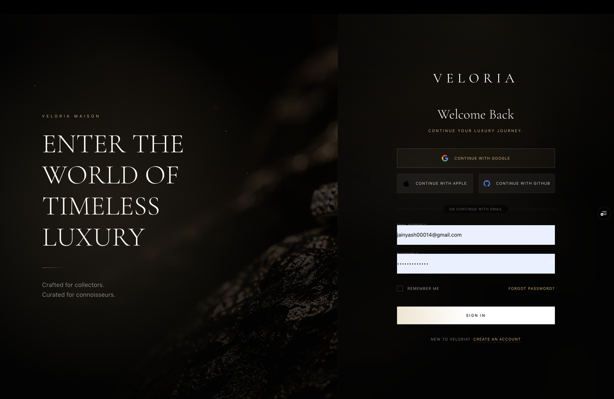
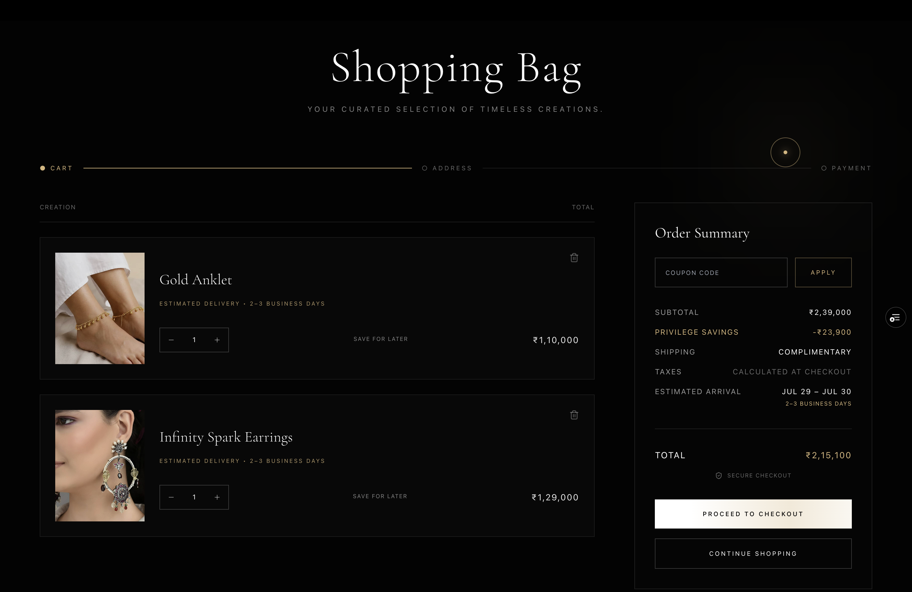
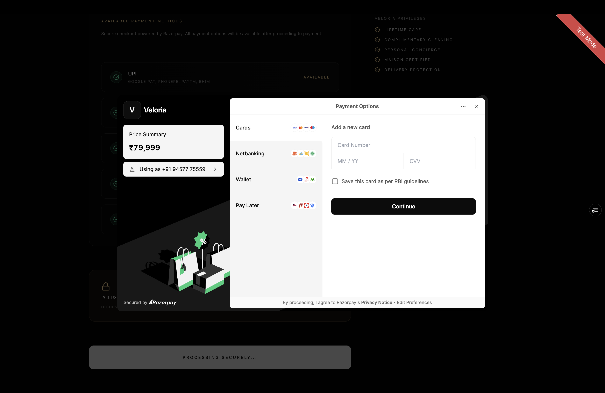
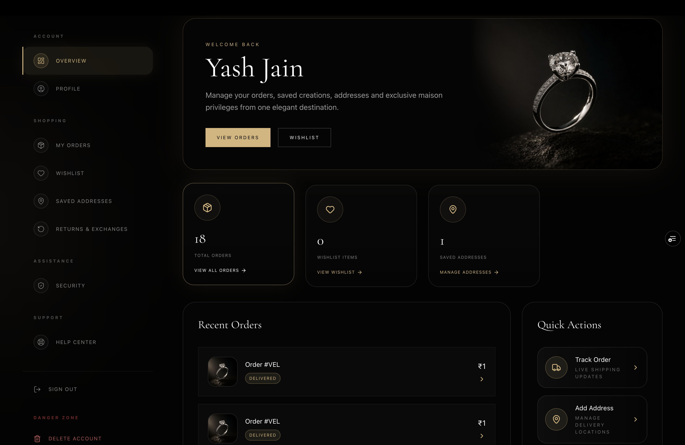
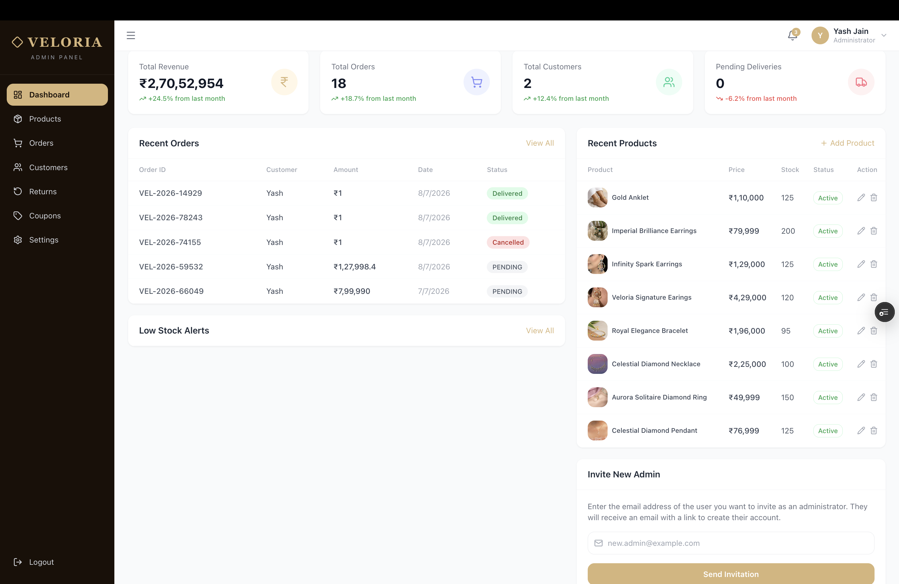
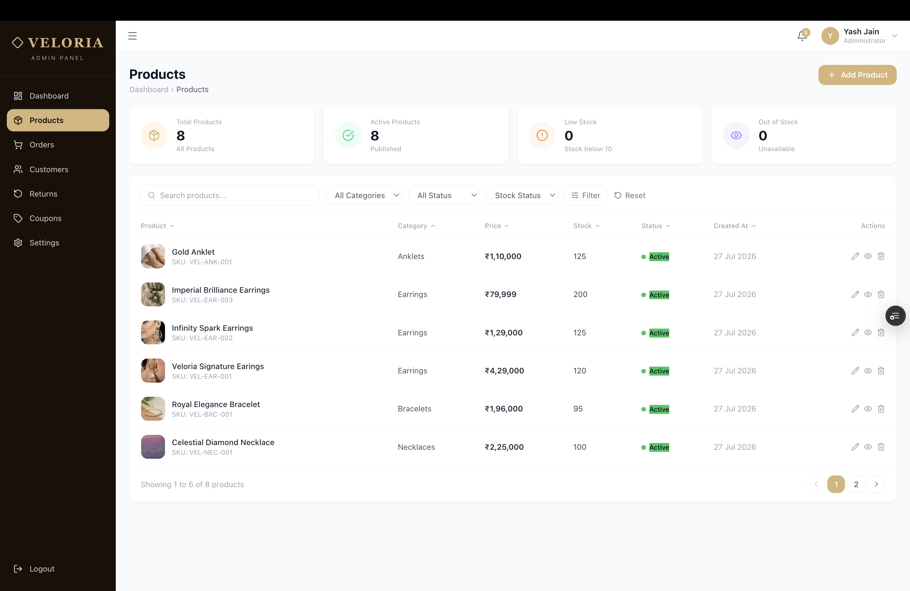
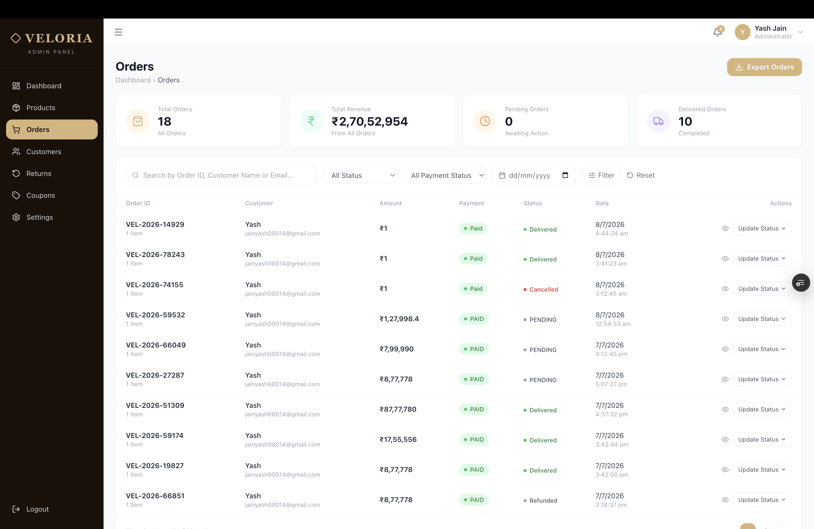
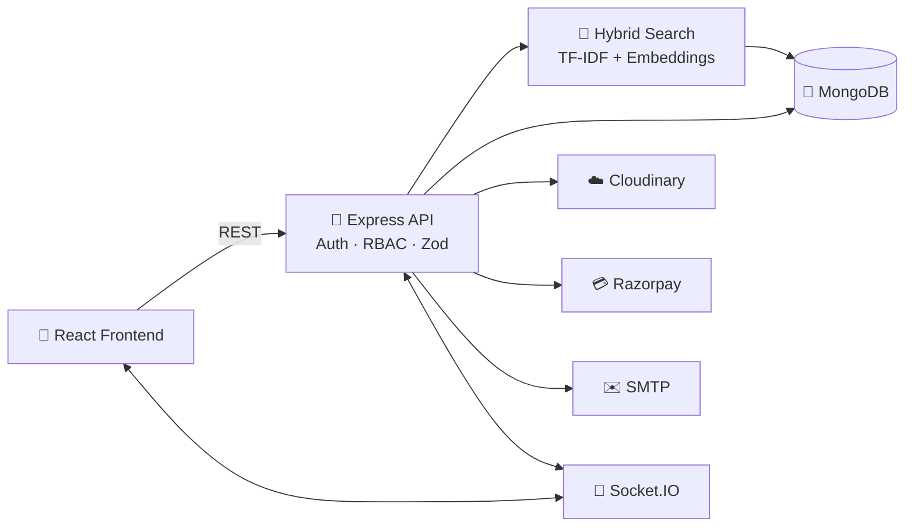

<div align="center">

# ✨ AI Powered E-Commerce Platform

## Production-grade Luxury E-Commerce Platform with AI-Powered Hybrid Search


<br>

[](https://www.typescriptlang.org/)
[](https://react.dev/)
[](https://nodejs.org/)
[](https://expressjs.com/)
[](https://www.mongodb.com/)
[](https://razorpay.com/)
[](https://jwt.io/)
[](https://tailwindcss.com/)
[](https://socket.io/)
[](https://cloudinary.com/)

<br>

[](https://veloria-ecommerce-five.vercel.app/)
[](YOUR_YOUTUBE_LINK)

<br>

**[📸 Screenshots](#-screenshots)** · **[🧠 AI Search](#-ai-powered-hybrid-search)** · **[⚙️ Setup](#️-getting-started)**

</div>

---

## 🛍️ About Veloria

**Veloria** is a production-grade, full-stack luxury jewelry e-commerce platform engineered to resemble a real-world commerce system rather than a tutorial project.

Rather than focusing only on a traditional shopping experience, the project explores how production-grade commerce systems are designed—combining intelligent search, secure transactions, role-based access control, and maintainable architecture into a single application.

### What makes Veloria different?

- 🧠 **AI-Powered Hybrid Search** — Implements a custom hybrid retrieval pipeline that combines BM25-inspired TF-IDF scoring with transformer-based semantic embeddings (`@xenova/transformers`) to deliver more relevant product search results.
- 🔒 **Security-Oriented Design** — Implements JWT authentication, OTP email verification, request validation, server-side price verification, RBAC, rate limiting, and protection against common vulnerabilities such as IDOR and privilege escalation.
- 👥 **Role-Based Platform** — Provides dedicated Buyer, Seller, and Admin dashboards with middleware-enforced authorization and independently scoped functionality.
- 🛒 **Complete Commerce Workflow** — Covers the entire purchasing lifecycle, including product discovery, cart management, checkout, payment processing, order tracking, invoices, and return/exchange requests.
- ⚡ **Scalable Backend Architecture** — Built using a modular service-oriented structure with separated controllers, services, middleware, models, and utilities for easier maintenance and future scalability.
- ☁️ **Production Integrations** — Integrates MongoDB, Cloudinary, Razorpay, Socket.IO, SMTP email services, PDF invoice generation, and an AI-powered search engine into a unified application.

---

## 📊 At a Glance

<div align="center">

| 🧩 Backend Models | 🎮 Controllers | 🛣️ API Route Groups | ⚙️ Services | 🖥️ Frontend Pages | 👤 User Roles |
|:---:|:---:|:---:|:---:|:---:|:---:|
| **9** | **15** | **14** | **13** | **34+** | **3** |

| 🧠 Embedding Dimensions | 🔍 Search Signals Fused | 📦 Order Statuses | 🎟️ Coupon Rule Types | 📅 Return Window | 💳 Payment Gateway |
|:---:|:---:|:---:|:---:|:---:|:---:|
| **384-dim** | **2 (Lexical + Semantic)** | **6** | **4+** | **7 days** | **Razorpay** |

</div>


---

### 📍 Login


### 🏠 Landing Page


### 🛍️ Products


### 🔍 AI Hybrid Search


### ❤️ Wishlist


### 🛒 Cart


### 💳 Checkout


### 👤 Profile


### 👨‍💼 Admin Dashboard


### 📦 Products Management


### 📋 Orders & Returns



---

## 🧠 AI-Powered Hybrid Search

The flagship feature of Veloria is a fully local hybrid retrieval engine built from scratch—combining lexical retrieval with transformer-based semantic search without relying on Algolia, Elasticsearch, Pinecone, or OpenAI APIs.

- **Lexical (BM25 TF-IDF)** — in-memory inverted index over product text, classic `k1=1.5, b=0.75` scoring for exact/keyword matches
- **Semantic (transformer embeddings)** — `Xenova/all-MiniLM-L6-v2` runs locally on CPU, generating 384-dim embeddings; queries matched via cosine similarity for meaning-based results (*"elegant wedding gift"* → relevant rings, even without those exact words)
- **Hybrid fusion** — `finalScore = 0.4 × lexical + 0.6 × semantic`, with each result tagged by match type (`hybrid`/`semantic`/`lexical`/`fallback`)
- **Live indexing** — embeddings and TF-IDF update instantly on product create/update/delete
- **Graceful fallback** — if the model fails, search silently degrades to lexical-only instead of breaking

**Why this is technically interesting:**
- Implements both lexical and semantic retrieval from scratch
- Demonstrates practical understanding of information retrieval concepts
- Runs entirely locally without external search APIs

---

## 🚀 Features

- **Catalog & Search** — metal/purity/gemstone/occasion filters, auto-slugs, AI hybrid search
- **Cart & Checkout** — persistent cart/wishlist, saved addresses, coupon engine (% / fixed, usage caps, expiry)
- **Payments & Orders** — Razorpay integration, Auto-generated PDF invoices for every order (via pdfkit), status emails
- **Returns & Exchanges** — 7-day window, reason codes, photo evidence, admin approval workflow
- **RBAC Dashboards** — Buyer (orders/returns), Admin (products, orders, coupons, customers, returns, settings, admin invites)
- **Auth & Security** — JWT + OTP verification, forgot/reset password, `helmet` + rate limiting + strict CORS, Zod validation everywhere
- **Frontend** — React 19 + Vite + TypeScript, Tailwind + Radix UI, Framer Motion, 3D product visuals (React Three Fiber + Spline), Zustand

---

## 🏗️ Architecture



---

## 🧰 Tech Stack

| Layer | Technologies |
|---|---|
| **Frontend** | React 19, TypeScript, Vite, Tailwind CSS, Zustand, Framer Motion, React Three Fiber, Radix UI |
| **Backend** | Node.js, Express 5, TypeScript, Mongoose |
| **Database** | MongoDB |
| **Auth** | JWT, bcrypt, OTP email verification |
| **Payments** | Razorpay |
| **Hybrid Search / AI** | Custom TF-IDF + BM25 + MiniLM Embeddings (`@xenova/transformers`) |
| **Media** | Cloudinary |
| **Real-time** | Socket.IO |
| **Email** | Nodemailer (SMTP) |
| **PDF** | PDFKit / Puppeteer |

---

## ⚙️ Getting Started

### Prerequisites
Node.js ≥ 18 · MongoDB (local or [Atlas](https://www.mongodb.com/atlas)) · Cloudinary account · Razorpay test keys · SMTP provider

### 1. Install
```bash
git clone <your-repo-url>
cd Veloria-Ecommerce-main
cd backend && npm install
cd ../frontend && npm install
```

### 2. Environment Variables

**`backend/.env`**
```env
NODE_ENV=development
PORT=5000
CLIENT_URL=http://localhost:5174
MONGODB_URI=your_mongodb_connection_string
JWT_SECRET=your_long_random_secret
CLOUDINARY_CLOUD_NAME=xxx
CLOUDINARY_API_KEY=xxx
CLOUDINARY_API_SECRET=xxx
RAZORPAY_KEY_ID=xxx
RAZORPAY_KEY_SECRET=xxx
SMTP_HOST=smtp.example.com
SMTP_PORT=587
SMTP_USER=xxx
SMTP_PASS=xxx
SMTP_FROM="Veloria <no-reply@veloria.com>"
ADMIN_EMAIL=admin@example.com
ADMIN_PASSWORD=choose_a_strong_password
```

**`frontend/.env`**
```env
VITE_API_URL=http://localhost:5000/api/v1
VITE_CLOUDINARY_CLOUD_NAME=xxx
VITE_RAZORPAY_KEY_ID=xxx
VITE_SUPABASE_URL=optional
VITE_SUPABASE_ANON_KEY=optional
```

### 3. Seed Admin (optional)
```bash
cd backend
npx ts-node src/controllers/seed.ts
```
- This creates an admin user using the `ADMIN_EMAIL` / `ADMIN_PASSWORD` values from your `.env`

### 4. Run
```bash
# Terminal 1
cd backend && npm run dev      # http://localhost:5000

# Terminal 2
cd frontend && npm run dev     # http://localhost:5174
```

### 5. Build for Production
```bash
cd backend && npm run build && npm start
cd frontend && npm run build && npm run preview
```

---

## 🛠️ Troubleshooting

| Issue | Fix |
|---|---|
| "Duplicate slug/name" on products | `cd backend && node fix-product-indexes.js` |
| Razorpay auth errors | Recheck `RAZORPAY_KEY_ID`/`SECRET` in `.env` (no quotes/spaces), restart server |
| CORS errors | Add your frontend origin to `allowedOrigins` in `backend/src/app.ts` |

---

## 🔒 Security Highlights

The security model was iteratively improved by identifying and fixing common web application vulnerabilities during development.

- ✅ Server-side price validation (no trusting client-sent totals)
- ✅ IDOR protection on cart, address, and order resources
- ✅ RBAC middleware enforced on every protected route
- ✅ OTP-verified authentication flows
- ✅ `helmet` + rate limiting + strict CORS
- ✅ Zod schema validation on all incoming requests

---

## 👤 Author

**Yash Jain**

Full-Stack Developer • Backend Engineer • AI Enthusiast

- 💼 GitHub: *[add link]*
- 🔗 LinkedIn: *[add link]*
- ✉️ Email: *jainyash1404@mail.com*

> ⭐ Star the repo if you found it useful!

---

<div align="center">

Built with ❤️ using React, Node.js, TypeScript & AI

</div>
